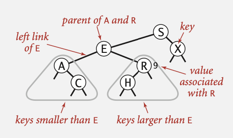
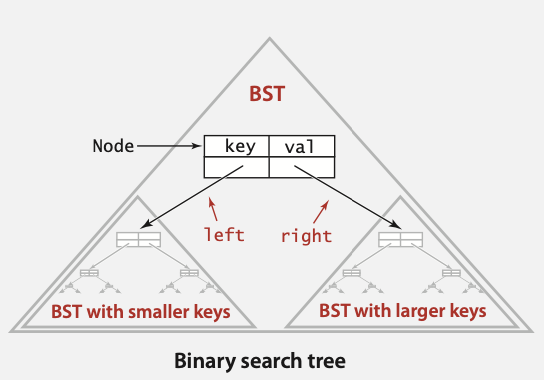

 

Introduction
------------

 

Notes from the course, Algorithms and Data Structures I took. These are notes
that are relevant for a general software engineering position.

 

Other courses, from my degree, that are relevant for a general, entry level
software engineering position are Introduction to Programming, Advanced
Telecommunications, Information Management II and Software Engineering. Notes
for these courses are also included in ../.

 

These summary notes are based mainly on content from the course, Algorithms and
Data Structures, but also from the textbook Algorithms by Robert Sedgewick and
Kevin Wayne, linked [here](https://algs4.cs.princeton.edu/home/) and from the
course Program Design and Methodology II at Duke University, linked
[here](https://www2.cs.duke.edu/courses/fall01/cps100/).

 

Overview
--------

 

-   Algorithm: Steps to perform a task that solves a general computational
    problem

-   Data Structures: The ways to store the information needed for the algorithm

-   Programs must be correct. Mathematical guarantee through formal
    verification. Confidence of correctness through testing

-   Programs must be efficient

 

Analysis of Algorithms
----------------------

 

-   Used to evaluate efficiency (performance)

-   How the program scales to larger inputs

-   Best case. Average case. Worst case. Generally consider the worst case

-   Experimental algorithmics

    -   Can measure running time using `Stopwatch()`, `double elapsedTime`

    -   System independent effects are algorithm, input data

    -   System dependent effects are hardware, software, system (OS)

-   Mathematical approach

    -   Most primitive operations take constant time (variable declaration,
        assignments, array access, array allocation). Can count frequency and
        then assign a cost to each

-   Cost models

    -   Cost model 1 - constants cost 1

    -   Cost model 2 - only highest order terms count (when N is large terms are
        negligible, when N is small we don’t care)

    -   Use tilde notation e.g. $$N+2$$ is $$~N$$, $$N(N-1)$$ is $$~N^2$$ and
        estimate performance by adding up these simplified frequencies

    -   Cost model 3 - count only some operations

 

Order of Growth and Asymptotic Notation
---------------------------------------

 

-   Order of growth ignores leading coefficients and ignores lower order terms

 

| **Order of Growth** | **Name**     | **Typical Code Framework**                                                                | **Description**    |
|---------------------|--------------|-------------------------------------------------------------------------------------------|--------------------|
| $$1$$               | Constant     | `a = b + c;`                                                                              | Statement          |
| $$\log{N}$$         | Logarithmic  | `while (N > 1) {N = N/2;}`                                                                | Divide in half     |
| $$N$$               | Linear       | `for(int i = 0; i < N; i++) {}`                                                           | Loop               |
| $$N \log{N}$$       | Linearithmic | ...                                                                                       | Divide and conquer |
| $$N^2$$             | Quadratic    | `for(int i = 0; i < N; i++) {for(int j = 0; j < N; j++) {}}`                              | Double loop        |
| $$N^3$$             | Cubic        | `for(int i = 0; i < N; i++) {for(int j = 0; j < N; j++) {for(int k = 0; k < N; k++) {}}}` | Triple loop        |
| $$2^N$$             | Exponential  | ...                                                                                       | Exhaustive search  |

 

-   $$\Theta (g(N))$$: $$f(n)$$ is bounded above and below by $$g(n)$$
    asymptotically (ignoring constant factors)

    -   Example: $$\Theta(N^2)$$

-   $$O(g(N))$$: $$f(n)$$ is bounded above by $$g(n)$$ asymptotically (ignoring
    constant factors)

    -   Example: $$O(N^2)$$

-   $$\Omega(g(N))$$: $$f(n)$$ is bounded below by $$g(n)$$ asymptotically
    (ignoring constant factors).

    -   Example: $$\Omega(N^2)$$

 

| **Notation** | **Provides**                | **Example**      | **Shorthand For**                        | **Used To**          |
|--------------|-----------------------------|------------------|------------------------------------------|----------------------|
| Big Theta    | Asymptotic order of growth  | $$\Theta(N^2)$$  | $$10N^2, 0.5N^2, 5N^2 + 22N \log N, …$$  | Classify algorithms  |
| Big Oh       | $$\Theta(N^2)$$ and smaller | $$O(N^2)$$       | $$10N^2, 100N, …$$                       | Develop upper bounds |
| Big Omega    | $$\Theta(N^2)$$ and larger  | $$\Omega(N^2)$$  | $$0.5N^2, N^5, …$$                       | Develop lower bounds |

 

**Properties of Asymptotic Notation**

 

*Sums​*

 

If $$f_{1}(n)$$ is  $$O(g_{1}(n))$$ and $$f_{2}(n)$$ is $$O(g_{2}(n))$$, then
$$f_{1}(n) + f_{2}(n)$$ is $$O(max\{g_1(n),g_2(n)\})$$

 

*Products​*

 

If $$f_{1}(n)$$ is  $$O(g_{1}(n))$$ and $$f_{2}(n)$$ is $$O(g_{2}(n))$$, then
$$f_{1}(n) \cdot f_{2}(n)$$ is $$O(g1(n)⋅g2(n))$$

 

**Bounds**

 

-   Upper bound: Performance guarantee of an algorithm for any input

-   Lower bound: No algorithm can do better for worst case inputs

 

**Amortised Analysis**

 

-   Starting from an empty data structure, average running time per operation
    over a worst-case sequence of operations

 

Data Structures Listing
-----------------------

 

Follow the below links.

 

1.  Stack

    1.  Linked-List Implementation: N/A

    2.  Linked-List Generic Implementation:
        <https://algs4.cs.princeton.edu/13stacks/LinkedStack.java.html>

    3.  Fixed-Capacity - Array Implementation:
        <https://algs4.cs.princeton.edu/13stacks/FixedCapacityStack.java.html>

    4.  Resizing - Array Implementation: N/A

    5.  Resizing - Generic Array Implementation:
        <https://algs4.cs.princeton.edu/13stacks/ResizingArrayStack.java.html>

2.  Queue

    1.  Linked-List Implementation: N/A

    2.  Linked-List Generic Implementation:
        <https://algs4.cs.princeton.edu/13stacks/Queue.java.html>

    3.  Fixed-Capacity - Array Implementation: N/A

    4.  Resizing - Array Implementation: N/A

    5.  Resizing - Generic Array Implementation:
        <https://algs4.cs.princeton.edu/13stacks/ResizingArrayQueue.java.html>

3.  Priority Queue

    1.  Unordered Array Implementation:
        <https://algs4.cs.princeton.edu/24pq/UnorderedArrayMaxPQ.java.html>

4.  Binary Search Tree

    1.  Generic Implementation:
        <https://algs4.cs.princeton.edu/32bst/BST.java.html>

 

Data Structures
---------------

 

**Java Generics**

 

-   Avoids casting the client. Discover type mismatch errors at compile-time
    instead of run-time

-   Achieved by specifying a type parameter, e.g. `Stack<Integer> i = new
    Stack<Integer>();`

-   Autoboxing: Allows dealing with primitive types. Each primitive type has a
    wrapper object type. Autoboxing performs a cast between a primitive type and
    its wrapper, e.g. `Stack<Integer> i = new Stack<Integer>(); i.push(17);`

-   Iterator: Is `java.lang.Iterable`. An `Iterable` has a method that returns
    an iterator. An iterator has methods `hasNext()` and `next()`. A data
    structure can be `Iterable` allowing elegant client code

-   Comparable: Is `.compareTo`. Comparable is a parametric interface because it
    doesn’t know a priori the type `T`

 

**Linked List**

 

~~~~~~~~~~~~~~~~~~~~~~~~~~~~~~~~~~~~~~~~~~~~~~~~~~~~~~~~~~~~~~~~~~~~~~~~~~~~~~~~
/**
 * Definition for singly-linked list.
 * public class ListNode {
 *     int val;
 *     ListNode next;
 *     ListNode() {}
 *     ListNode(int val) { this.val = val; }
 *     ListNode(int val, ListNode next) { this.val = val; this.next = next; }
 * }
 */
~~~~~~~~~~~~~~~~~~~~~~~~~~~~~~~~~~~~~~~~~~~~~~~~~~~~~~~~~~~~~~~~~~~~~~~~~~~~~~~~

 

**Stack**

 

-   LIFO

-   API:

    -   StackOfStrings() - create an empty stack

    -   void push(String item) - insert a new string onto the stack

    -   String pop() - remove and return the string most recently added

    -   boolean isEmpty() - is the stack empty?

    -   int size() - number of strings on the stack

-   Using a Linked-List:

    -   Maintain a pointer first to first node in a singly linked-list

    -   Push new item before first

    -   Pop item from first

-   Using a Fixed-Capacity Array:

    -   Use array s[] to store items in stack

    -   push(): Add new item at s[N]

    -   pop(): Remove item from s[N-1]

-   Using a Resizing Array:

    -   push(): Double size of array s[] when array is full

    -   pop(): Halve size of array s[] when array is one-quarter full

 

**Queue**

 

-   FIFO

-   API:

    -   QueueOfStrings(): Create an empty queue

    -   void enqueue(String item): Insert a new string onto queue

    -   String dequeue(): Remove and return the string least recently added

    -   boolean isEmpty(): Is the queue empty?

    -   int size(): Number of strings on the queue

-   Using a Linked-List:

    -   Maintain one pointer first to first node in a singly-linked list

    -   Maintain another pointer last to last node

    -   Dequeue from first

    -   Enqueue after last

-   Using a Fixed-Capacity Array:

    -   Use array q[] to store items in a queue

    -   enqueue(): Add new item at q[tail]

    -   dequeue(): Remove item from q[head]

    -   Update head and tail modulo the capacity

 

**Priority Queue**

 

-   Remove the largest item

-   API:

    -   MaxPQ(): Create an empty priority queue

    -   MaxPQ(Key[] a): Create a priority queue with given keys

    -   void insert(Key v): Insert a key into the priority queue

    -   Key delMax(): Return and remove the largest key

    -   boolean isEmpty(): Is the priority queue empty?

    -   Key max(): Return the largest key

    -   int size(): Number of entries in the priority queue

 

**Binary Search Tree**

 

~~~~~~~~~~~~~~~~~~~~~~~~~~~~~~~~~~~~~~~~~~~~~~~~~~~~~~~~~~~~~~~~~~~~~~~~~~~~~~~~
/**
 * Definition for a binary tree node.
 * public class TreeNode {
 *     int val;
 *     TreeNode left;
 *     TreeNode right;
 *     TreeNode() {}
 *     TreeNode(int val) { this.val = val; }
 *     TreeNode(int val, TreeNode left, TreeNode right) {
 *         this.val = val;
 *         this.left = left;
 *         this.right = right;
 *     }
 * }
 */
~~~~~~~~~~~~~~~~~~~~~~~~~~~~~~~~~~~~~~~~~~~~~~~~~~~~~~~~~~~~~~~~~~~~~~~~~~~~~~~~

 

-   A binary tree in symmetric order

-   A binary tree can be empty or have two disjoint binary trees (left and
    right)

-   Symmetric order means each node has a key and every node’s key is:

    -   Larger than all keys in its left subtree

    -   Smaller than all keys in its right subtree

-   Terminology:

    -   Leaves of tree: The nodes with no child nodes

    -   Height of tree: The maximum number of links from the root to a leaf

    -   Levels of tree: The maximum number of nodes from the root to a leaf
        (including root and leaf)

    -   Size of tree: The number of nodes in the tree

    -   Depth of a node: The number of links from the root to this node

 

 

-   Operations:

    -   Search - If less, go left; if greater, go right; if equal, search hit

    -   Insert - If less, go left; if greater, go right; if null, insert

    -   Get - Return value corresponding to given key, or null if no such key

    -   Put - Associate value with key. Search for key, then two cases:

        -   Key in tree —\> reset value

        -   Key not in tree —\> add new node

 

 

Algorithms Listing
------------------

 

Follow the below links.

 

1.  Binary Search:
    <https://algs4.cs.princeton.edu/11model/BinarySearch.java.html>

2.  Selection Sort:
    <https://algs4.cs.princeton.edu/21elementary/Selection.java.html>

3.  Insertion Sort:
    <https://algs4.cs.princeton.edu/21elementary/Insertion.java.html>

4.  Quick Sort: <https://algs4.cs.princeton.edu/23quicksort/Quick.java.html>

 

Algorithms
----------

 

**Design**

 

-   Brute-force: Enumerate all possible candidates and check if each candidate
    satisfies the problem statement, e.g. selection sort

-   Decrease and conquer: Establish relationship between a problem and a smaller
    instance of that problem, e.g. insertion sort

-   Divide and conquer: Divide a problem into several subproblems of the same
    type, ideally of the same size, e.g. quick sort, binary tree traversal

-   Transform and conquer: Modify a problem to be more amenable to solution,
    then solve, e.g. 2-3 trees

-   Greedy: Always take the choice that looks best at the moment, e.g. Djikstra

-   Dynamic programming: Similar to divide and conquer but in divide and conquer
    subproblems are disjoint and in dynamic programming subproblems overlap
    (solutions to those are stored, indexed and reused)

 

**Time Complexity​**

 

| **Algorithm**  | **Best**          | **Average**       | **Worst**       |
|----------------|-------------------|-------------------|-----------------|
| Selection Sort | $$O(n^2)$$        | $$O(n^2)$$        | $$O(n^2)$$      |
| Insertion Sort | $$O(n)$$          | $$O(n^2)$$        | $$O(n^2)$$      |
| Quick Sort     | $$O(n \log{n})$$  | $$O(n \log{n})$$  | $$O(n^2)$$      |
| Binary Search  | $$O(1)$$          | $$O(\log{n})$$    | $$O(\log{n})$$  |

 

**Use Cases**

 

-   Selection Sort: Insensitive to the data. Good if we want to have our sort
    always take the same time

-   Insertion Sort: Good when the number of inversions is small

-   Quick Sort: Fastest practical sort. Has excellent average-case behaviour

-   Binary Search: For when you have a sorted list

 

**Binary Search**

 

-   Too small, go left

-   Too big, go right

-   Equal, found

 

**Selection Sort**

 

-   Description: Find the minimum of the remaining elements each time

-   Situation after ith pass: First i elements are sorted and in proper position

 

**Insertion Sort**

 

-   Description: Pass through and insert record into a (sorted) list of the
    records processed so far

-   Situation after ith pass: First i elements sorted

 

**Quick Sort**

 

-   Description: Base case - Is our portion of the vector close to sorted? If
    so, just use insertion sort. Divide step - Choose a pivot and divide the
    vector into elements smaller than the pivot and elements greater than it

 
