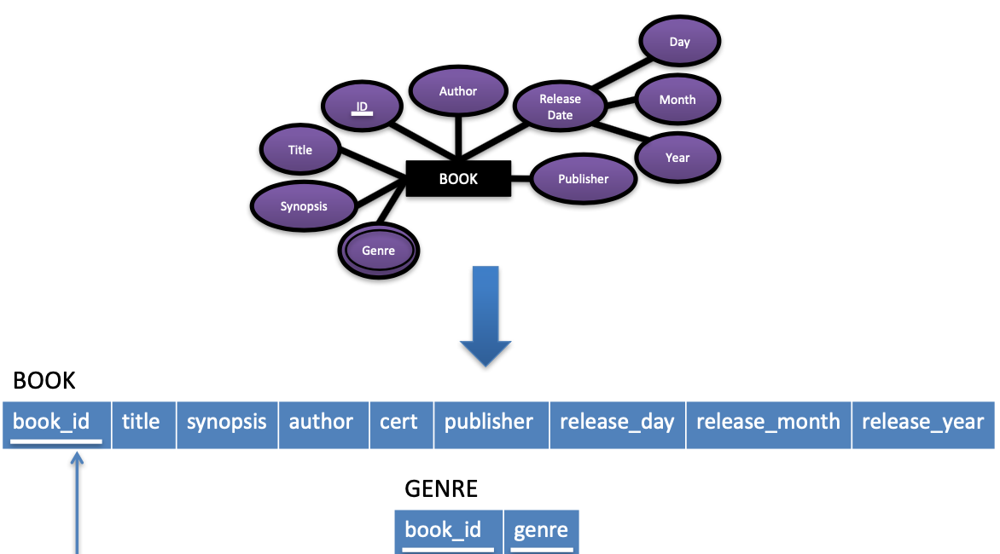

 

Introduction
------------

Notes from the course, Information Management II I took. These are notes that
are relevant for a general software engineering position.

 

Other courses, from my degree, that are relevant for a general, entry level
software engineering position are Introduction to Programming, Algorithms and
Data Structures, Advanced Telecommunications and Software Engineering. Notes for
these courses are also included in `../`.

 

These summary notes are based mainly on content from the course, Information
Management II.

 

Advantages of a Database
------------------------

 

-   Eliminate redundancy - Data duplication

-   Data independence - Views of data without affecting the underlying
    representation

-   Data integrity - Using integrity constraints

 

Structured Query Language
-------------------------

 

-   Data definition language - Modify schema

-   Data modification language - Modify stored data

-   Data query language - Get reports

-   Data control language - Transactions (a way to group actions that must
    happen atomically)

 

Database Architecture
---------------------

 

-   External level (views), conceptual level (logical schema), internal level
    (physical schema)

 

Database Models
---------------

 

-   Relational Database: Relations (tables), tuples (rows), attributes (columns)

-   Domain: The values that can appear in each column

-   Degree: Number of attributes in a relation

-   Atomic: Each value in a tuple is atomic

-   Null Value: Unknown value, value exists but is not available, attribute does
    not apply to this tuple (value undefined)

-   Constraints:

    -   Implicit/Model-Based

    -   Explicit/Schema-Based

    -   Semantic/Application-Based

-   Primary Key: Attribute(s) whose value(s) uniquely identify tuples of a
    relation

-   Entity Integrity Constraint: No duplicate entries in the primary key, NULL
    values not permitted

-   Referential Integrity: A tuple in one relation that refers to a tuple in
    another, must refer to an existing tuple

-   Foreign Key: Specifies a referential integrity constraint between two
    relations

 

Relational Algebra
------------------

 

-   Selection: Identify the subset of tuples from a relation that satisfy a
    selection condition

    -   In SQL: `SELECT * FROM Employee WHERE Dept = 4 AND Salary > 25`

    -   Selectivity: Fraction of tuples in a relation selected by a condition is
        known as the selectivity of that condition

-   Projection: Selects certain attributes from the table while discarding the
    others

    -   In SQL: `SELECT FName, LName, Salary FROM Employee`

    -   Duplicates tuples are merged, thus only distinct tuples are returned in
        formal relational algebra. In SQL use the `DISTINCT` keyword, `SELECT
        DISTINCT …`

-   Combining: Use nesting

    -   In SQL: `SELECT FName, LName, Salary FROM Employee WHERE Dept = 4 AND
        Salary > 25`

-   Set Operations: Possible if relations are union compatible (same number of
    attributes, each corresponding pair of attributes has the same domain)

    -   Union: Commutative, associative, e.g. `UNION`

    -   Intersection: Commutative, associative, e.g. `INTERSECT`

    -   Difference: Not commutative, e.g. `EXCEPT`

    -   Each eliminate duplicates. To not eliminate duplicates use, `ALL`, e.g.
        `UNION ALL`

-   Join: Combine related tuples from two relations into a single tuple

    -   In SQL: `SELECT Employee.name, job, Department.name FROM Employee,
        Department WHERE Employee.Dept = Department.Dept`

 

Relational Database Design
--------------------------

 

**Normalised Table**

 

1.  Row order is not significant

2.  Column order is not significant

3.  Each row/column intersection contains a single attribute value

4.  Each row in a table must be distinct (i.e. a row can be uniquely identified
    by quoting an appropriate combination of attribute values)

 

**Functional Dependency**

 

-   If there are rules such that duplicate values of attribute A are always
    associated with the same value of attribute B (within any given occurrence
    of the table) then attribute A is a determinant of attribute B (A —\> B)

-   Example: A part number (the determinant) functionally determines the part
    description.

-   If part number determines quantity then composite attribute {part number,
    part description} also determines quantity, but part description is
    superfluous

-   Determinants should not contain any superfluous attributes

-   Diagram: Place attributes in boxes, —\> from attribute(s) that determine
    other attribute(s)

 

**Codd Normal Form**

 

1.  Relations should have no multivalued attributes or nested relations. Remedy:
    Form new relations for each multivalued attribute or nested relation

2.  For relations where primary key contains multiple attributes, no non-key
    attribute should be functionally dependent on a part of the primary key.
    Remedy: Decompose and set up new relation for each partial key with its
    dependent attribute(s). Make sure to keep a relation with the original
    primary key and any attributes that are functionally dependent on it

3.  Relation should not have a non-key attribute functionally determined by
    another non-key attribute (or by a set of non-key attributes). That is,
    there should be no transitive dependency of a non-key attribute on the
    primary key. Remedy: Decompose and set up a relation that includes the
    non-key attribute(s) that functionally determine(s) other non-key
    attribute(s)

 

**Identifiers**

 

-   Identifying an individual row

-   Rows can be identified by quoting the values of all its attributes. However,
    some values may not be needed

-   Attributes that functionally determine may be identifiers. Those that can be
    are known as candidate identifiers

    -   If X is a candidate key of R, X has to be unique for every instance of R
        (thus X uniquely determines all the other attributes of R)

 

**Boyce/Codd Normal Form**

 

-   Every determinant must be a candidate identifier

-   “All attributes in a relation should be dependent on the key, the whole key
    and nothing but the key”

-   Remedy: Create new tables such that each non-identifying determinant in the
    old table becomes a candidate identifier in a new table

 

**Fully Normalised Tables**

 

-   Tables structured in such a way that they cannot contain redundant data

 

Entity Relationship Modelling
-----------------------------

 

Conceptual design (entity relationship model).

 

**Entities**

 

-   A real world object

 

**Attributes**

 

-   Properties that describe the real world object

-   Simple Attribute: Example, age (cannot be divided)

-   Composite Attribute: Example, address (can be divided)

-   Single-Valued Attribute: Example, age (takes a number)

-   Multi-Valued Attribute: Example, genre (horror and action)

-   Stored Attribute: Example, date of birth

-   Derived Attribute: Example, age is derived from the stored attribute date of
    birth

 

 

**Entity Relationship Diagrams**

 

-   Entity in a rectangle. Attributes in circles

-   Key Attribute: Underlined. One or more attributes whose values are unique
    for each instance of the entity set

-   Relationships: Captures how two or more entity types are related to one
    another

-   Roles: [MOVIE] - Shown in - \<SHOW\> - Shows [SCREENING]

-   Recursive: [EMPLOYEE] - Supervises - Supervised by \<SUPERVISION\>

-   Relationship Constraints - cardinality: 1:1, 1:N, M:N

-   Relationship Constraints - participation:

    -   Total - Everyone in the entity participates (double line)

    -   Partial - Some in the entity participate (single line)

-   Relationship types can have attributes

 

 

 

 

Mapping to Logical Design
-------------------------

 

Move from the conceptual design (entity relationship model) to a logical design
(relational schema)

 

**Mapping Entity Types**

 

-   For each entity type in E, create a relation, R, that includes all the
    simple attributes

-   Composite Attributes: When mapping composite attributes include only the
    simple component attributes in the new relation, R

-   Key Attributes: Choose one of the key attributes of E as the primary key of
    R. Composite key attributes are included as a composite primary key

 

**Mapping Multivalued Attributes**

 

-   For each multivalued attribute A, create a new relation R

    -   Will include an attribute corresponding to A

    -   The primary key K from the relation that represent the entity type that
        A came from. This becomes the foreign key in R

    -   The primary key of R is the combination of A and K

 

 

**Mapping 1:1 Relationships**

 

1.  Identify the participating relations S and T

2.  Choose one of the participating relations, e.g. S

3.  Include as a foreign key in S the primary key of T

4.  Include all the simple attributes of the relationship type R as attributes
    of S

 

 

**Mapping 1:N Relationships**

 

1.  Identify the relation S that corresponds to the entity types on the N-side
    of R

2.  Include as a foreign key in S, the primary key of T (which is the relation
    representing the entity type at the other side of R)

3.  Include any simple attributes of the relationship type R as attributes of S

 

 

**Mapping Recursive Relationships**

 

1.  Include the primary key of T (which is the relation representing the entity
    type involved), as a foreign key in the same relation, T

2.  Include any simple attributes of the relationship type R as attributes of T

 

 

**Mapping M:N Relationships**

 

1.  For each binary M:N relationship type R, create a new relation S to
    represent R

2.  Include as foreign key attributes in S the primary keys of the relations
    that represent the participating entity types

3.  Include any simple attributes of the relationship type R as attributes of S

 

 

Design Optimisations
--------------------

 

Following conceptual design and logical design, we now optimise the design. We
optimise with guidelines, normalisation and functional dependencies

 

**Guidelines**

 

1.  Give relations and attributes meaningful names

2.  Design the relation schemas so that no insertion, deletion or modification
    anomalies are present

    1.  Insertion anomalies e.g. Adding an employee to an employee-department
        table

    2.  Deletion anomalies e.g. Deleting the last employee in a department from
        an employee-department table

    3.  Modification anomalies e.g. Changing the department manager in an
        employee-department table

3.  Avoid placing attributes in a relation schema whose values may frequently be
    null

4.  Design relation schemas so that they can be joined using equality conditions
    on primary key, foreign key pairs

 

**Normalisation**

 

See earlier in the notes.

 

**Functional Dependencies**

 

-   You can use a set of data to disprove a functional dependency

-   Use constraints to specify that a functional dependency should hold

    -   SSN = {Ename,Bdate,Address,Dnumber}

 

 

**Summary of Modelling a Database**

 

Be aware of the guidelines and go through the steps:

1.  Conceptual design (entity relationship model)

2.  Logical design (relational schema)

3.  Functional dependencies

4.  Normalisation

 

**Other Terminology**

 

-   Superkey: Any set of attributes in the relation R, whose combined values
    will be unique for every tuple. Every relation has one default super key -
    the set of all attributes

-   Boyce-Codd Normal Form: A simpler form of 3NF. However, it is stricter as
    every relation in BCNF is also 3NF, every relation in 3NF is not necessarily
    BCNF

 

Database Constraints
--------------------

 

-   Integrity constraints are concerned with accidental corruption

-   Explicit constraints are expressed in the relational schema

-   Semantic constraints cannot be expressed in the relational schema (instead
    they are expressed by SQL or usually application programs)

-   Key (PRIMARY KEY in SQL), entity (PRIMARY KEY in SQL) and referential
    (FOREIGN KEY in SQL) are integrity constraints (see earlier in notes)

-   Note that foreign keys in certain circumstances can be NULL

 

**Constraint Violation**

 

| **Key** | **Entity​** | **Referential** |
|---------|------------|-----------------|
| Insert  | Insert     | Insert          |
| Update  | Update     | Update          |
|         |            | Delete          |

 

**Handling Constraint Violation**

 

| **Key**       | **Entity​**    | **Referential**                                                                             |
|---------------|---------------|---------------------------------------------------------------------------------------------|
| Reject insert | Reject insert | Reject insert                                                                               |
| Reject update | Reject update | Reject update or cascade update or update and set corresponding foreign key to null/default |
|               |               | Reject delete or cascade delete or delete and set corresponding foreign key to null/default |

 

-   Cascading means to propagate back up the way

-   SET NULL ON UPDATE \| ON DELETE or CASCADE ON UPDATE \| ON DELETE or SET
    DEFAULT ON UPDATE \| ON DELETE are the alternatives to the default reject
    option in SQL for referential integrity

 

**Constraints in SQL**

 

1.  `PRIMARY KEY`: Sets the primary key

2.  `FOREIGN KEY`: Sets the foreign key

3.  `UNIQUE`: Results in a specification of secondary keys

4.  `NOT NULL`: Default is that SQL allows nulls, primary key always given this

5.  `CHECK`: For example, specifying that all IDs must be greater than 0

6.  `ASSERTION`: A standalone constraint in a schema. Used to specify a
    restriction that affects more than one table. Checked at the end of each SQL
    statement. Cannot modify data

7.  `TRIGGER`: A standalone constraint in a schema. Checked only when certain
    events occur. Can modify data. All assertions can be implemented by triggers

 

Database Security
-----------------

 

-   Security policies and access control are concerned with deliberate
    corruption

-   Database administrator is responsible for user accounts, privileges,
    security levels

 

**Accounts**

 

-   User accounts are created and privileges are granted

 

**Privileges**

 

*Account Level Privileges*

-   `CREATE SCHEMA`

-   `CREATE TABLE`

-   `ALTER`

-   `DROP`

 

*Relation Level Privileges*

-   `SELECT`, i.e. read

-   `INSERT`, `UPDATE`, `DELETE`, i.e. modify

-   Give ability to refer to a relation when specifying integrity constraints,
    i.e. reference

 

*Views*

-   A discretionary authorisation mechanism

-   Owner of a relation grants partial access to information contained in that
    relation i.e. restricted set of attributes, restricted set of rows

 

*Granting*

-   `GRANT` command in SQL e.g. `GRANT privilege ON relation TO user`

-   Can also create a view and then in turn grant privileges on that view

 

*Revoking*

-   `REVOKE privilege ON relation FROM user`

 

*Propagation of Privileges*

-   `GRANT privilege ON relation TO user WITH GRANT OPTION`

-   Be careful: A grants B. A grants C. B and C grant D. B revokes from D but D
    still has the privilege from C!

 

**Security Levels**

 

*Mandatory Access Control*

-   Desirable for government, military. Not standard in commercial DBMS

-   Top secret, secret, confidential, unclassified

-   Each subject is given a security level. Each object is given a security
    level. Security level of a subject is compared with that of the object to
    determine if an action is allowed

 

*Discretionary Access Control*

-   Flexible, complex to manage. Compare this to MAC which is rigid. Trade-off
    is security and applicability

 

*Role-Based Access Control*

-   Privileges and other permissions are associated with organisational roles
    rather than individual user accounts

-   `CREATE ROLE`, `DESTROY ROLE`, `GRANT role TO user`

 

Transactions and Concurrency Control
------------------------------------

 

-   Transaction is a logical unit of DB processing that must be completed

-   Concurrency control handles when two operations try to access the same data
    at the same time

 

NoSQL
-----

 

**SQL**

 

-   Filter, store and distribute

-   Depends on a pre-filter

-   Assumes a single disk farm

-   Assume monolithic memory

-   Hard to partition

 

**NoSQL**

 

-   Store, filter, distribute

-   Non-relational

-   No SQL as a query language

-   Schema less

-   Usually open source

-   Distributed

-   Does not use ACID transactions

 

**Sharding**

 

-   Different data on different nodes

 

**Replication**

 

-   Same data is replicated and copied over multiple nodes

 

**CAP Theorem**

 

-   Consistency: All nodes see the same data at the same time

-   Availability: A guarantee that every request receives a response about
    whether it

succeeded or failed

-   Partition Tolerance: The system continues to operate despite arbitrary
    partitioning due to network failures

 

**ACID**

 

-   Everything in a transaction succeeds or the entire transaction is rolled
    back (atomic)

-   A transaction cannot leave the the database in an inconsistent state
    (consistent)

-   Transactions cannot interfere with each other (isolated)

-   Completed transactions persist even when servers restart (durable)

 

**BASE**

 

-   Base availability - an application works most of the time

-   Soft-state - it does not have to be consistent all the time

-   Eventual-consistency - it will be in some known state eventually

 

Each node is always available to serve requests. As a trade-off, data
modifications are propagated in the background to other nodes. The system may be
inconsistent but the data is still largely accurate.

 

**Data Models**

 

The data model is not the storage model. Describes how we interact with the
data.

 

-   Key-value (not the best for aggregate queries)

-   Graph

-   Document (store using JavaScript Object Notation - JSON)

-   BigTable

 

SQL Pseudocode Samples
----------------------

 

**Sample 1**

 

~~~~~~~~~~~~~~~~~~~~~~~~~~~~~~~~~~~~~~~~~~~~~~~~~~~~~~~~~~~~~~~~~~~~~~~~~~~~~~~~
ALTER TABLE director ADD COLUMN type VARCHAR(255) 
~~~~~~~~~~~~~~~~~~~~~~~~~~~~~~~~~~~~~~~~~~~~~~~~~~~~~~~~~~~~~~~~~~~~~~~~~~~~~~~~

 

**Sample 2**

 

~~~~~~~~~~~~~~~~~~~~~~~~~~~~~~~~~~~~~~~~~~~~~~~~~~~~~~~~~~~~~~~~~~~~~~~~~~~~~~~~
CREATE TRIGGER `correctType` 
AFTER INSERT ON `conversation` 
FOR EACH ROW
DELETE FROM conversation 
WHERE (conversation.type <> conversation.userType) 
~~~~~~~~~~~~~~~~~~~~~~~~~~~~~~~~~~~~~~~~~~~~~~~~~~~~~~~~~~~~~~~~~~~~~~~~~~~~~~~~

 

**Sample 3**

 

~~~~~~~~~~~~~~~~~~~~~~~~~~~~~~~~~~~~~~~~~~~~~~~~~~~~~~~~~~~~~~~~~~~~~~~~~~~~~~~~
CREATE TABLE movie_test(id INT NOT NULL, title VARCHAR(255) NOT NULL, year INT(4), PRIMARY KEY(id)); 
~~~~~~~~~~~~~~~~~~~~~~~~~~~~~~~~~~~~~~~~~~~~~~~~~~~~~~~~~~~~~~~~~~~~~~~~~~~~~~~~

 

**Sample 4**

 

~~~~~~~~~~~~~~~~~~~~~~~~~~~~~~~~~~~~~~~~~~~~~~~~~~~~~~~~~~~~~~~~~~~~~~~~~~~~~~~~
ALTER TABLE movie_genre ADD CONSTRAINT FOREIGN KEY (movie_id) REFERENCES movie(id);
~~~~~~~~~~~~~~~~~~~~~~~~~~~~~~~~~~~~~~~~~~~~~~~~~~~~~~~~~~~~~~~~~~~~~~~~~~~~~~~~

 

 

**Sample 5**

 

~~~~~~~~~~~~~~~~~~~~~~~~~~~~~~~~~~~~~~~~~~~~~~~~~~~~~~~~~~~~~~~~~~~~~~~~~~~~~~~~
UPDATE movie SET movie.released = 2009 WHERE movie.released = 2010; 
~~~~~~~~~~~~~~~~~~~~~~~~~~~~~~~~~~~~~~~~~~~~~~~~~~~~~~~~~~~~~~~~~~~~~~~~~~~~~~~~

 

**Sample 6**

 

~~~~~~~~~~~~~~~~~~~~~~~~~~~~~~~~~~~~~~~~~~~~~~~~~~~~~~~~~~~~~~~~~~~~~~~~~~~~~~~~
SELECT movie_writer.movie_id FROM movie_writer WHERE movie_writer.writer_id = writer.id 
~~~~~~~~~~~~~~~~~~~~~~~~~~~~~~~~~~~~~~~~~~~~~~~~~~~~~~~~~~~~~~~~~~~~~~~~~~~~~~~~

 

**Sample 7**

 

~~~~~~~~~~~~~~~~~~~~~~~~~~~~~~~~~~~~~~~~~~~~~~~~~~~~~~~~~~~~~~~~~~~~~~~~~~~~~~~~
SELECT video_chat_id FROM video_chat WHERE participants > 10; 
~~~~~~~~~~~~~~~~~~~~~~~~~~~~~~~~~~~~~~~~~~~~~~~~~~~~~~~~~~~~~~~~~~~~~~~~~~~~~~~~

 

**Sample 8**

 

~~~~~~~~~~~~~~~~~~~~~~~~~~~~~~~~~~~~~~~~~~~~~~~~~~~~~~~~~~~~~~~~~~~~~~~~~~~~~~~~
SELECT movie_director.movie_id, movie_director.director_id, director.theDirector FROM movie_director INNER JOIN director ON(movie_director.director_id = director.id); 
~~~~~~~~~~~~~~~~~~~~~~~~~~~~~~~~~~~~~~~~~~~~~~~~~~~~~~~~~~~~~~~~~~~~~~~~~~~~~~~~

 

**Sample 9**

 

~~~~~~~~~~~~~~~~~~~~~~~~~~~~~~~~~~~~~~~~~~~~~~~~~~~~~~~~~~~~~~~~~~~~~~~~~~~~~~~~
SELECT column1, column2, ...
INTO new_table FROM old_table WHERE condition; 
~~~~~~~~~~~~~~~~~~~~~~~~~~~~~~~~~~~~~~~~~~~~~~~~~~~~~~~~~~~~~~~~~~~~~~~~~~~~~~~~

 

**Sample 10**

 

~~~~~~~~~~~~~~~~~~~~~~~~~~~~~~~~~~~~~~~~~~~~~~~~~~~~~~~~~~~~~~~~~~~~~~~~~~~~~~~~
ALTER TABLE movie_writer ADD CONSTRAINT (movie_id = 3); 
~~~~~~~~~~~~~~~~~~~~~~~~~~~~~~~~~~~~~~~~~~~~~~~~~~~~~~~~~~~~~~~~~~~~~~~~~~~~~~~~

 

**Sample 11**

 

~~~~~~~~~~~~~~~~~~~~~~~~~~~~~~~~~~~~~~~~~~~~~~~~~~~~~~~~~~~~~~~~~~~~~~~~~~~~~~~~
INSERT INTO movie_writer (movie_id, writer_id) VALUES (5, 5); 
~~~~~~~~~~~~~~~~~~~~~~~~~~~~~~~~~~~~~~~~~~~~~~~~~~~~~~~~~~~~~~~~~~~~~~~~~~~~~~~~

 

**Sample 12**

 

~~~~~~~~~~~~~~~~~~~~~~~~~~~~~~~~~~~~~~~~~~~~~~~~~~~~~~~~~~~~~~~~~~~~~~~~~~~~~~~~
ALTER TABLE movie_writer ADD CONSTRAINT FOREIGN KEY (movie_id) REFERENCES movie(id) ON DELETE CASCADE; 
~~~~~~~~~~~~~~~~~~~~~~~~~~~~~~~~~~~~~~~~~~~~~~~~~~~~~~~~~~~~~~~~~~~~~~~~~~~~~~~~

 

**Sample 13**

 

~~~~~~~~~~~~~~~~~~~~~~~~~~~~~~~~~~~~~~~~~~~~~~~~~~~~~~~~~~~~~~~~~~~~~~~~~~~~~~~~
DELETE from writer WHERE writer.id = 3 
~~~~~~~~~~~~~~~~~~~~~~~~~~~~~~~~~~~~~~~~~~~~~~~~~~~~~~~~~~~~~~~~~~~~~~~~~~~~~~~~

 

**Sample 14**

 

~~~~~~~~~~~~~~~~~~~~~~~~~~~~~~~~~~~~~~~~~~~~~~~~~~~~~~~~~~~~~~~~~~~~~~~~~~~~~~~~
CREATE TABLE movie_test(id INT NOT NULL, title VARCHAR(255) NOT NULL, year INT(4), PRIMARY KEY(id), CONSTRAINT values CHECK (year IN (1, 2, 3)); 
~~~~~~~~~~~~~~~~~~~~~~~~~~~~~~~~~~~~~~~~~~~~~~~~~~~~~~~~~~~~~~~~~~~~~~~~~~~~~~~~

 

**Sample 15**

 

~~~~~~~~~~~~~~~~~~~~~~~~~~~~~~~~~~~~~~~~~~~~~~~~~~~~~~~~~~~~~~~~~~~~~~~~~~~~~~~~
CREATE ASSERTION balance CHECK((SELECT SUM(outstanding) from PURCHASES) < (SELECT SUM(other_num) from PURCHASES); 
~~~~~~~~~~~~~~~~~~~~~~~~~~~~~~~~~~~~~~~~~~~~~~~~~~~~~~~~~~~~~~~~~~~~~~~~~~~~~~~~

 

**Sample 16**

 

~~~~~~~~~~~~~~~~~~~~~~~~~~~~~~~~~~~~~~~~~~~~~~~~~~~~~~~~~~~~~~~~~~~~~~~~~~~~~~~~
SELECT title, SUM(runtime) FROM movie WHERE id = 1 
~~~~~~~~~~~~~~~~~~~~~~~~~~~~~~~~~~~~~~~~~~~~~~~~~~~~~~~~~~~~~~~~~~~~~~~~~~~~~~~~
